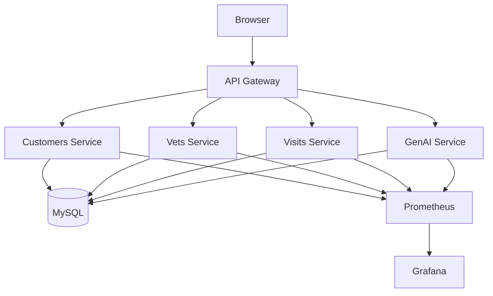
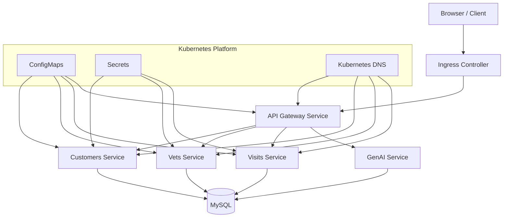
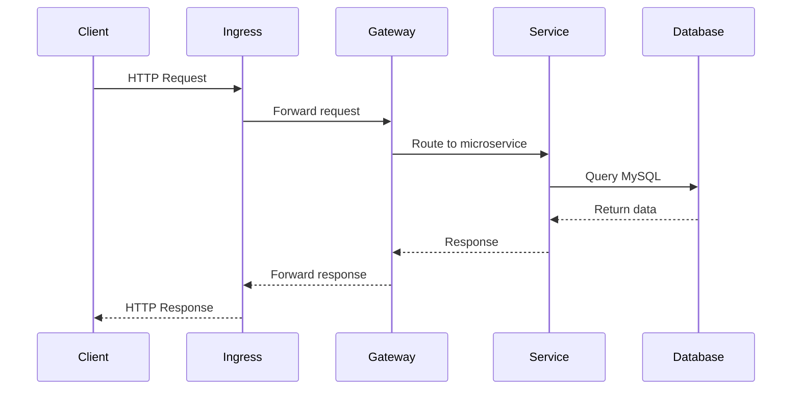

# ☸️ Phase 2 — Kubernetes Native Architecture (Enhancement of Phase 1)

## Overview

In **Phase 1**, the Petclinic microservices platform was modernized using **Docker Compose** by removing legacy Spring Cloud infrastructure and replacing it with container-native networking and configuration.

Phase 2 builds on top of that work by deploying the same architecture to **Kubernetes (Amazon EKS)** using **Kubernetes-native primitives**.

The goal of this phase is to remove application-level infrastructure components and replace them with **native Kubernetes capabilities**.

---

# Relationship to Phase 1

Phase 1 introduced several key architectural improvements:

- Removed **Spring Cloud Config Server**
- Removed **Netflix Eureka Discovery Server**
- Replaced service discovery with **Docker DNS**
- Introduced **environment-based configuration**
- Centralized routing through **Spring Cloud Gateway**
- Added **Prometheus and Grafana for observability**

Phase 2 enhances this architecture by replacing Docker Compose infrastructure with **Kubernetes platform primitives**.

---

# Architecture Evolution

## Phase 1 — Docker Compose Architecture



Key characteristics:

- Docker DNS for service discovery
- `.env` configuration
- Gateway based routing
- Prometheus and Grafana observability

---

## Phase 2 — Kubernetes Architecture



---

# Request Flow (End-to-End)

This diagram shows how a request travels through the system.



Example request:

```
http://petclinic.local/api/customer/owners
```

Flow:

```
Browser
 ↓
Ingress
 ↓
API Gateway
 ↓
Customers Service
 ↓
MySQL
 ↓
Response
```

---

# Key Kubernetes Enhancements

Phase 2 replaces several application-level infrastructure components with Kubernetes-native mechanisms.

| Legacy Component | Phase 1 Replacement | Phase 2 Replacement |
|---|---|---|
| Config Server | `.env` | ConfigMaps |
| Eureka Discovery | Docker DNS | Kubernetes Service DNS |
| Container Networking | Docker Compose | Kubernetes Services |
| Environment Variables | `.env` | Secrets + ConfigMaps |
| External Access | Docker Ports | Kubernetes Ingress |

---

# Kubernetes Resource Design

Each microservice is deployed using the following Kubernetes resources:

```
Deployment
Service
ConfigMap
Secret
```

These resources provide:

- container orchestration
- networking
- configuration management
- secure credential storage

---

# Namespace

All resources are deployed into a dedicated namespace.

```
petclinic
```

Create namespace:

```bash
kubectl create namespace petclinic
```

---

# Kubernetes Service Discovery

Kubernetes automatically provides **internal DNS resolution**.

Example service DNS names:

```
customers-service.petclinic.svc.cluster.local
vets-service.petclinic.svc.cluster.local
visits-service.petclinic.svc.cluster.local
mysql.petclinic.svc.cluster.local
```

This replaces the need for **Eureka Discovery Server**.

---

# Configuration Management

Instead of Spring Cloud Config Server, Kubernetes **ConfigMaps** provide application configuration.

Example ConfigMap:

```
customers-service-config
```

The ConfigMap contains the full `application.yml`.

Spring Boot automatically loads external configuration from:

```
/config/application.yml
```

The file is mounted into the container using a ConfigMap volume.

---

# Secret Management

Sensitive credentials are stored using **Kubernetes Secrets**.

Example secret:

```
mysql-credentials
```

The secret stores:

```
DB_USERNAME
DB_PASSWORD
```

These values are injected into containers as environment variables.

---

# API Gateway

The **Spring Cloud Gateway** service acts as the single entry point to the platform.

All client requests flow through the gateway.

Example routes:

```
/api/customer/** → customers-service
/api/vet/**      → vets-service
/api/visit/**    → visits-service
/api/genai/**    → genai-service
```

Gateway routing uses **Kubernetes service DNS** instead of Eureka.

---

# Ingress

Kubernetes **Ingress** exposes the API Gateway externally.

Example host:

```
petclinic.local
```

Ingress forwards all traffic to the `api-gateway` service.

---

# Kubernetes Deployment Structure

```
kubernetes/
│
├── mysql/
│   ├── deployment.yaml
│   ├── service.yaml
│   └── secret.yaml
│
├── customers-service/
│   ├── deployment.yaml
│   ├── service.yaml
│   └── configmap.yaml
│
├── vets-service/
│   ├── deployment.yaml
│   ├── service.yaml
│   └── configmap.yaml
│
├── visits-service/
│   ├── deployment.yaml
│   ├── service.yaml
│   └── configmap.yaml
│
└── api-gateway/
    ├── deployment.yaml
    ├── service.yaml
    ├── configmap.yaml
    └── ingress.yaml
```

---

# Deployment Steps

## 1 Create namespace

```bash
kubectl create namespace petclinic
```

---

## 2 Deploy MySQL

```bash
kubectl apply -f kubernetes/mysql/
```

---

## 3 Deploy microservices

```bash
kubectl apply -f kubernetes/customers-service/
kubectl apply -f kubernetes/vets-service/
kubectl apply -f kubernetes/visits-service/
```

---

## 4 Deploy API Gateway

```bash
kubectl apply -f kubernetes/api-gateway/
```

---

## 5 Deploy Ingress

```bash
kubectl apply -f kubernetes/api-gateway/ingress.yaml
```

---

# Troubleshooting Log (ConfigMap + DNS Modernization)

These are the actual issues encountered while moving from Config Server/Eureka to Kubernetes ConfigMaps and DNS.

## 1 Services in `CrashLoopBackOff` with `ConfigClientFailFastException`

Symptom:
- pods for `customers-service`, `visits-service`, `vets-service` kept restarting
- logs showed calls to `http://config-server:8888/...` and `UnknownHostException: config-server`

Root cause:
- deployments still had legacy Spring Cloud Config settings (`SPRING_CONFIG_IMPORT`, `CONFIG_SERVER_URL`, related config-client flags)
- app was still trying to fetch remote config from Config Server even after modernization

Fix:
- removed legacy Config Server environment variables from service deployments
- mounted service `ConfigMap` as `/config/application.yml`
- ensured Spring reads local external config from `/config`

Why this fix works:
- config is now loaded directly from Kubernetes ConfigMap, so startup no longer depends on Config Server availability or DNS name.

---

## 2 Gateway routes not applied after moving config to ConfigMap

Symptom:
- gateway returned unexpected `404`/`405` for valid API paths
- backend services were healthy but routing behavior was wrong

Root cause:
- incorrect Spring Cloud Gateway property namespace in external config
- WebFlux gateway expected `spring.cloud.gateway.server.webflux.routes`

Fix:
- corrected route config key in `api-gateway` ConfigMap
- re-applied ConfigMap and restarted `api-gateway` deployment

Why this fix works:
- gateway loads route definitions from the correct property tree and can route `/api/customer/**`, `/api/vet/**`, `/api/visit/**` properly.

---

## 3 Service DNS confusion during migration

Symptom:
- intermittent resolution/connectivity issues while switching away from old discovery assumptions

Root cause:
- mixed use of legacy service names and Kubernetes DNS assumptions during transition
- stale rollout replicas still running old env/config in some cases

Fix:
- standardized service references to Kubernetes service names in `petclinic` namespace
- where needed, used full DNS format: `<service>.petclinic.svc.cluster.local`
- forced clean rollout restart after config changes

Commands used:

```bash
kubectl apply -f kubernetes/customers-service/deploy.yaml
kubectl apply -f kubernetes/visits-service/deploy.yaml
kubectl apply -f kubernetes/vets-service/deployment.yaml
kubectl -n petclinic rollout restart deploy/customers-service deploy/visits-service deploy/vets-service
kubectl -n petclinic rollout status deploy/customers-service
kubectl -n petclinic rollout status deploy/visits-service
kubectl -n petclinic rollout status deploy/vets-service
```

Why this fix works:
- all pods start with consistent DNS targets and consistent config source.

---

## 4 Ingress looked broken even when services were healthy

Symptom:
- browser showed Not Found or unresolved host
- direct curl with ALB host + `Host: petclinic.local` worked

Root cause:
- local machine DNS/hosts mapping was not aligned with current ALB endpoint
- using `/` path can return 404 depending on gateway route design; API paths worked

Fix:
- validated ingress via ALB hostname and API path first
- updated `/etc/hosts` for `petclinic.local` to a resolvable ALB IP/DNS
- tested actual routed endpoints (for example `/api/customer/owners`)

Why this fix works:
- confirms edge routing and gateway path rules independently from local browser DNS cache issues.

---

## 5 Controller/Ingress dependency issue before DNS routing

Symptom:
- ingress had no address or repeated reconciliation failures
- events showed `AccessDenied: Not authorized to perform sts:AssumeRoleWithWebIdentity`

Root cause:
- AWS Load Balancer Controller IRSA/service account configuration was incomplete

Fix:
- created/validated `aws-load-balancer-controller` service account with correct IAM role annotation
- restarted controller and waited for successful rollout

Why this fix matters to modernization:
- Kubernetes DNS + ConfigMaps can be correct, but external traffic still fails without working ingress controller credentials.

---

## Quick Validation Checklist After Any ConfigMap/DNS Change

```bash
kubectl get pods -n petclinic
kubectl get svc -n petclinic
kubectl get ingress -n petclinic
kubectl -n petclinic logs deploy/api-gateway --tail=100
kubectl -n petclinic logs deploy/customers-service --tail=100
```

Expected:
- all core pods `Running` and `READY 1/1`
- no Config Server lookup errors in logs
- gateway routes return `200` on API paths
- ingress has an address/hostname when enabled

---

# Verification

Check pods:

```bash
kubectl get pods -n petclinic
```

Check services:

```bash
kubectl get svc -n petclinic
```

Check ingress:

```bash
kubectl get ingress -n petclinic
```

---

# Testing the Platform

Test via the API Gateway.

```
http://petclinic.local/api/customer/owners
http://petclinic.local/api/vet/vets
http://petclinic.local/api/visit/owners/1/pets/1/visits
```

If everything is configured correctly:

- requests reach the gateway
- gateway routes to backend services
- services query MySQL
- responses return to the client

---

# Observability

Prometheus collects metrics from services.

Example metrics endpoint:

```
/actuator/prometheus
```

Grafana visualizes metrics dashboards.

---

# Benefits of Phase 2 Architecture

This Kubernetes-native architecture provides:

- simplified runtime infrastructure
- native service discovery
- centralized configuration
- secure secret management
- scalable deployments
- production-ready networking

Legacy Spring Cloud infrastructure components are no longer required.

---

# Phase 3 (Future Enhancements)

Possible next improvements include:

- Blue/Green deployments
- Canary deployments
- GitOps using ArgoCD
- Horizontal Pod Autoscaling (HPA)
- Distributed tracing
- Service mesh integration

---

# Summary

Phase 2 successfully migrates the modernized Docker architecture from Phase 1 into Kubernetes using native platform constructs.

The platform now runs on:

- Kubernetes
- Spring Boot
- Spring Cloud Gateway
- Prometheus
- Grafana
- Amazon EKS

This architecture closely reflects **real-world cloud platform engineering practices used in production environments**.
